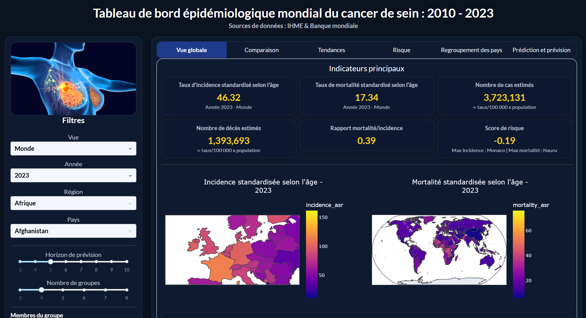

<h1 align="center">
  <strong>Projet : Tableau de bord épidémiologique mondial du cancer de sein : 2010 - 2023</strong>
</h1>

## Application en ligne
Le dashboard est accessible ici : https://dashboard-cancer-du-sein.onrender.com

**Voir le script ici :** [`app.py`](app.py)

## Rapport du projet
**Le rapport de ce projet disponible au format pdf :**

## Apperçu du dashboard

Le cancer du sein constitue l’un des cancers les plus fréquents chez les femmes à l’échelle mondiale. Son incidence et sa mortalité varient fortement selon le niveau de développement économique, l’accès au dépistage, la qualité du système de santé, la structure démographique et l’urbanisation.

L’objectif de ce projet est de construire un système d’analyse épidémiologique, allant de la collecte des données jusqu’à un tableau de bord interactif, permettant :
- l’analyse descriptive,
- l’exploration des disparités internationales,
- l’analyse temporelle,
- la modélisation statistique,
- la stratification du risque,
- le regroupement de pays selon leur profil.

## 1. Collecte de données
### 1.1. Données de la Banque Mondiale : Webscraping
Dans un premier temps, avec le Webscraping, les indicateurs suivants ont été extraits pour chaque pays et chaque année grâce à l’API Banque Mondiale entre 2010 et 2025 :
- PIB par habitant (gdp_per_capita),
- Dépenses de santé (% du PIB), (health_exp_gdp),
- Population totale (population),
- Population urbaine (urban_pop_pct).

Ces indicateurs ont été utilisés pour rendre les modèles statistiques plus riches et pour réaliser le regroupement des pays.

- **Voir le script ici :** [`scripts/webscraping.py`](scripts/webscraping.py)
- **Le jeu de données obtenu de la Banque Mondiale :** [`data/wb_data_wide_2010_2025.csv`](data/wb_data_wide_2010_2025.csv)

En revanche, il n'était pas possible d'extraire directement les données sur le cancer du sein depuis la Banque Mondiale. Nous étions donc passés par l'IHME pour pouvoir accéder aux données relatives au cancer du sein.

### 1.2. Données provenant de l'IHME - GBD (Global Burden Desease)
Des données issues du programme Global Burden of Disease (GBD) de l’IHME ont été téléchargées selon les indicateurs suivants :
- Cause : Cancer du sein
- Sexe : Femmes
- Âge : Standardisé selon l’âge
- Mesures sélectionnées : Incidence (ASR) et Mortalité (ASR)
- Période : 2010-2023
- Niveau : Pays
  
Les colonnes retenues sont les suivantes :
- location_id,
- location_name,
- year,
- incidence_asr,
- mortality_asr.

Actuellement, les données ne sont disponibles que jusqu'en 2023. Ce qui nous a contraint à travailler sur une période de 2010 à 2023.
- **Voir le jeu de données IHME-GBD :** [`data/IHME-GBD_2023_DATA.csv`](data/IHME-GBD_2023_DATA.csv)

## 2. Nettoyage et harmonisation des données
### 2.1. Rectification de l'encodage
Les noms de certains pays ont montré des problèmes d'encodage. Nous avons donc réalisé :
- le réencodage en utf-8,
- le nettoyage des caractères spéciaux,
- l'uniformisation des apostrophes et accents.

### 2.2. Harmonisation des pays
Les noms issus de l'IHME ne correspondent pas toujours exactement à ceux de la Banque Mondiale. Donc, nous avons effectué :
- la suppression des espaces superflus,
- la correction des variantes (exemple : États Unis/United States),
- le mapping manuel pour les cas complexes,
- la conversion vers le code ISO3 avec (pycountry).

*Au total, **203 pays IHME** ont été mappés.*

## 3. Jointure des bases de données
Après l'obtention des différentes bases de données, la jointures entre elles a été faites sur les clés :
- iso3,
- année (year).
  
La base de données finale obtenue est composée des variables suivantes :
- location_id,
- location_name,
- incidence_asr,
- mortality_asr,
- population,
- gdp_per_capita,
- health_exp_gdp,
- urban_pop_pct,
- iso3,
- country,
- region_std (continent).

**Base de données finale :** [`dataset_final_cancer_sein_IHME_WB_2010_2023.csv`](dataset_final_cancer_sein_IHME_WB_2010_2023.csv)

## 4. Construction des indicateurs épidémiologiques
Cette étape est réalisée dans la fonction **add_features()** du code.

### 4.1. Estimation des cas et décès
Nous avons estimé les cas et décès suivant la formule :
- estimated_cases = (incidence_asr / 100000) * population
- estimated_deaths = (mortality_asr / 100000) * population

Ces estimations permettent une lecture plus concrète des volumes de cas et décès.

### 4.2. Détermination de la létalité (Ratio mortalité / incidence)

Elle a été calculée selon la formule : fatality_proxy = mortality_asr / incidence_asr

Ce ratio permet d’apprécier la sévérité relative du cancer.

### 4.3. Variations annuelles
Nous avons calculé les variations annuelles par pays (pct_change() × 100).

Elles permettent d’identifier :

- accélérations,
- ralentissements,
- ruptures de tendance.

### 4.4. Score de risque composite
Nous avons construit un score synthétique à partir de :
- l'incidence,
- la mortalité,
- ratio mortalité/incidence,
- la variation annuelle de mortalité.

Ce score permet d’identifier les pays nécessitant une surveillance prioritaire.

## 5. Analyse comparative

Le dashboard permet :

- le classement des pays selon l'incidence, la mortalité, le ratio mortalité/incidence, le nombre de cas estimés;
- la visualisation cartographique mondiale.

Ces outils facilitent l’identification des pays les plus touchés.

## 6. Analyse des tendances temporelles
Pour un pays ou au niveau mondial, nous avons calculé :
- l'évolution de l’incidence,
- l'évolution de la mortalité,
- les variations annuelles.

## 7. Regroupement des pays (Clustering)
Le regroupement des pays a été effectué par la standardisation des variables, le KMeans et la visualisation en 2 dimensions grâce à l'Analyse en Composante Principale (ACP)

Ceci permet d'identifier des profils homogènes des pays selon :
- leur niveau d’incidence,
- leur niveau de mortalité,
- leur contexte structurel.

## 8. Modélisation statistique
## 8.1 Prédiction de la mortalité
Un modèle Random Forest Regressor est entraîné pour prédire la mortalité à partir des variables :
- incidence
- population
- indicateurs structurels

## 8.2. Prévision des tendances
Une régression linéaire simple a été utilisée pour projeter :
- l'incidence future
- la mortalité future

avec un horizon configurable de 3 à 10 ans.
Cette prévision repose uniquement sur la tendance passée.

## 9. Structure du dashboard
Le dashboard que nous avons produit comprend 6 onglets tels que :
- Vue globale
- Comparaison des pays
- Tendances
- Risque
- Regroupement des pays
- Prédiction et prévision

Chaque onglet comprend :
- des visualisations interactives,
- des indicateurs synthétiques,
- un bloc d’interprétation automatique.

## 10. Technologies utilisées
- Python
- Pandas
- NumPy
- Scikit-learn
- Plotly
- Dash
- Dash Bootstrap Components

# Les membres du groupe :
- ADECHIAN Hippolyte
- AGBAHOUNGBA Joseph Giovanni
- KENGNI Francheska Elvira
